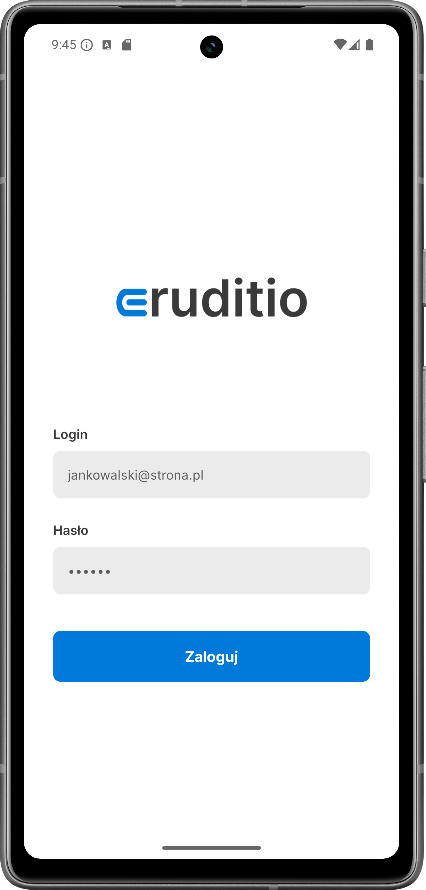
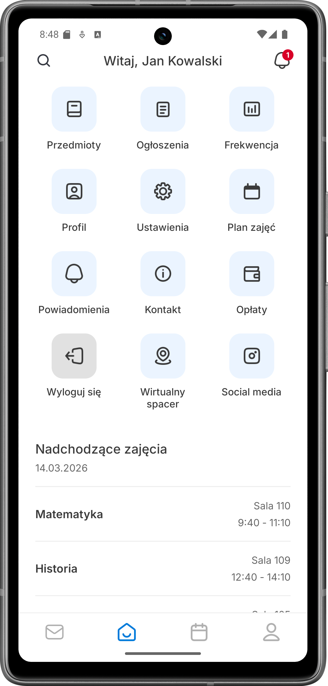
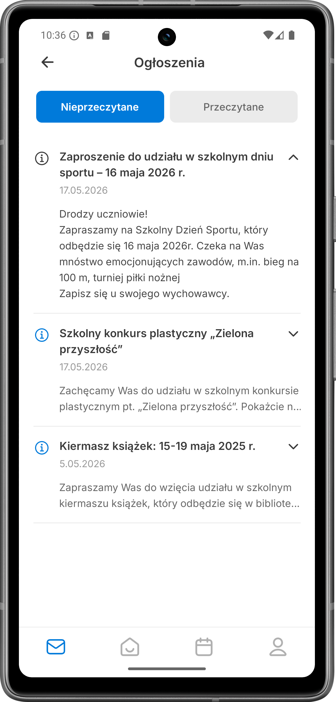
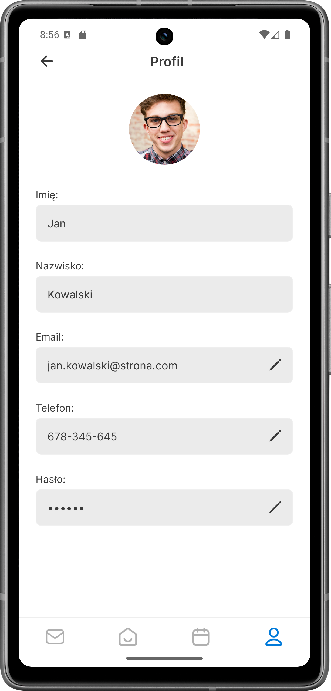
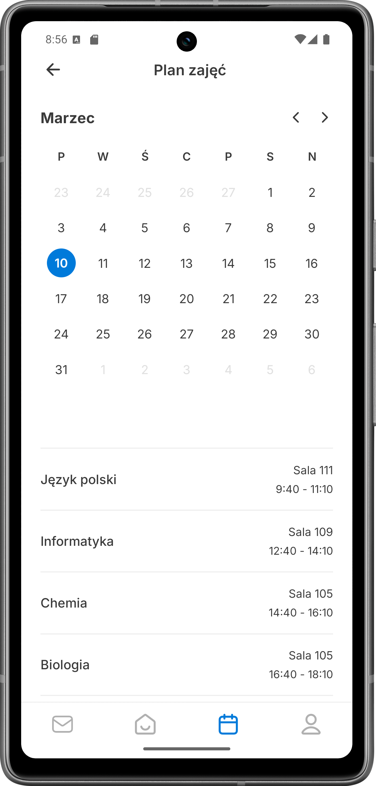
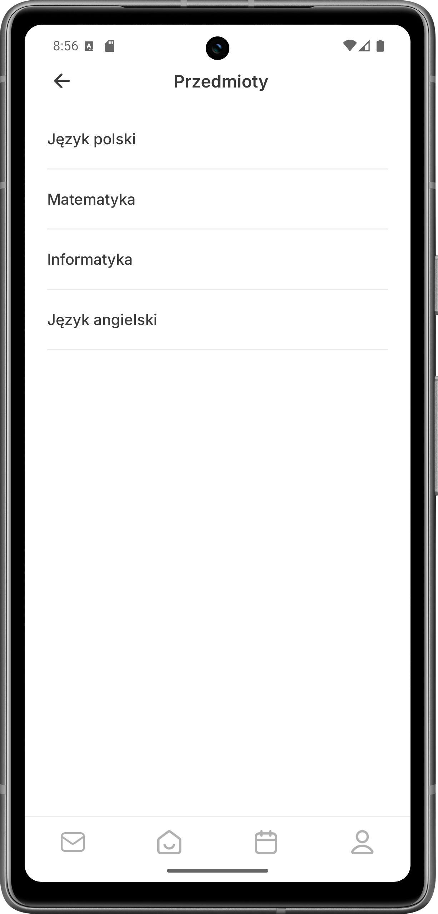

# Eruditio - aplikacja mobilna (prototyp UI)

Projekt stanowi interaktywną implementację warstwy wizualnej (Front-end) aplikacji edukacyjnej "Eruditio". Celem kodu jest weryfikacja założeń projektowych UI/UX (stworzonych pierwotnie w środowisku Figma) w natywnym środowisku urządzeń mobilnych.

## Stos technologiczny
* **Technologia główna:** React Native
* **Środowisko programistyczne:** Expo
* **Nawigacja:** React Navigation (Native Stack)
* **Typografia:** @expo-google-fonts (Inter)

## Zakres implementacji (Front-end)
Zakres prac programistycznych ograniczono do stworzenia w pełni responsywnej warstwy wizualnej. Logika biznesowa oraz połączenia bazodanowe zostały pominięte, a interfejs operuje na lokalnych, statycznych danych tekstowych. 

Zaimplementowano w pełni działający stos nawigacyjny oraz następujące ekrany:
* **LoginScreen:** ekran autoryzacji z polami formularza.
* **HomeScreen:** główny pulpit nawigacyjny zawierający siatkę kafelków menu oraz listę nadchodzących zajęć.
* **ProfileScreen:** ekran profilu użytkownika wyświetlający dane kontaktowe.
* **ScheduleScreen:** plan zajęć z siatką kalendarza.
* **SubjectsScreen:** moduł dedykowany przeglądowi przedmiotów.
* **NoticesScreen:** centrum ogłoszeń.

### Podgląd interfejsu

<p align="center">
  
  &nbsp; &nbsp;
  
  &nbsp; &nbsp;
  
</p>

<p align="center">
  
  &nbsp; &nbsp;
  
  &nbsp; &nbsp;
  
</p>

## Uruchomienie projektu lokalnie (Instrukcja krok po kroku)

Aby przetestować aplikację na własnym sprzęcie, upewnij się, że spełniasz poniższe wymagania wstępne, a następnie postępuj zgodnie z instrukcją.

### Wymagania wstępne
Zanim zaczniesz, upewnij się, że masz zainstalowane następujące narzędzia:
1. **Node.js** (wersja LTS) – środowisko uruchomieniowe JavaScript niezbędne do odpalenia projektu. Do pobrania za darmo z oficjalnej strony: [nodejs.org](https://nodejs.org/). Wraz z instalatorem automatycznie dodany zostanie menedżer pakietów **npm**.
2. **Aplikacja Expo Go** – darmowa aplikacja kliencka, którą należy pobrać na swój fizyczny smartfon bezpośrednio ze sklepu Google Play (dla systemu Android) lub App Store (dla systemu iOS). 

### Proces instalacji i uruchomienia

**Krok 1: przygotowanie plików projektu** 

Pobierz kod źródłowy projektu (np. jako paczkę ZIP udostępnioną jako załącznik lub pobraną z repozytorium) i wypakuj go w wybranym miejscu na swoim dysku. Następnie otwórz ten rozpakowany folder w swoim terminalu (może to być wiersz poleceń, PowerShell lub terminal wbudowany w edytor, np. VS Code).

**Krok 2: instalacja zależności** 

Będąc w głównym folderze projektu (tam, gdzie znajduje się plik `package.json`), uruchom poniższą komendę. Pobierze ona wszystkie biblioteki niezbędne do działania aplikacji (m.in. paczki React Native, system nawigacji i font Inter):
```bash
npm install
```

**Krok 3: uruchomienie serwera deweloperskiego Expo** 

Gdy instalacja paczek zakończy się sukcesem, wystartuj serwer. Używamy flagi -c (clear), aby wymusić wyczyszczenie pamięci podręcznej i upewnić się, że poprawnie załadują się najnowsze zasoby graficzne:

```bash
npx expo start -c
```

**Krok 4: testowanie na fizycznym urządzeniu mobilnym** 

Po uruchomieniu powyższej komendy, w Twoim terminalu pojawi się duży kod QR.

* **Użytkownicy Androida:** otwórz pobraną wcześniej aplikację Expo Go i wybierz opcję "Scan QR code".
* **Użytkownicy iOS (iPhone):** otwórz standardową aplikację Aparat (Camera) wbudowaną w telefon, nakieruj obiektyw na kod QR wyświetlany na ekranie monitora i kliknij powiadomienie, które otworzy projekt w środowisku Expo Go.

> **Ważna uwaga techniczna:** aby projekt załadował się poprawnie, Twój komputer (serwer) oraz urządzenie mobilne (klient) muszą być podłączone do tej samej sieci Wi-Fi (nie mogą to być dane komórkowe).

